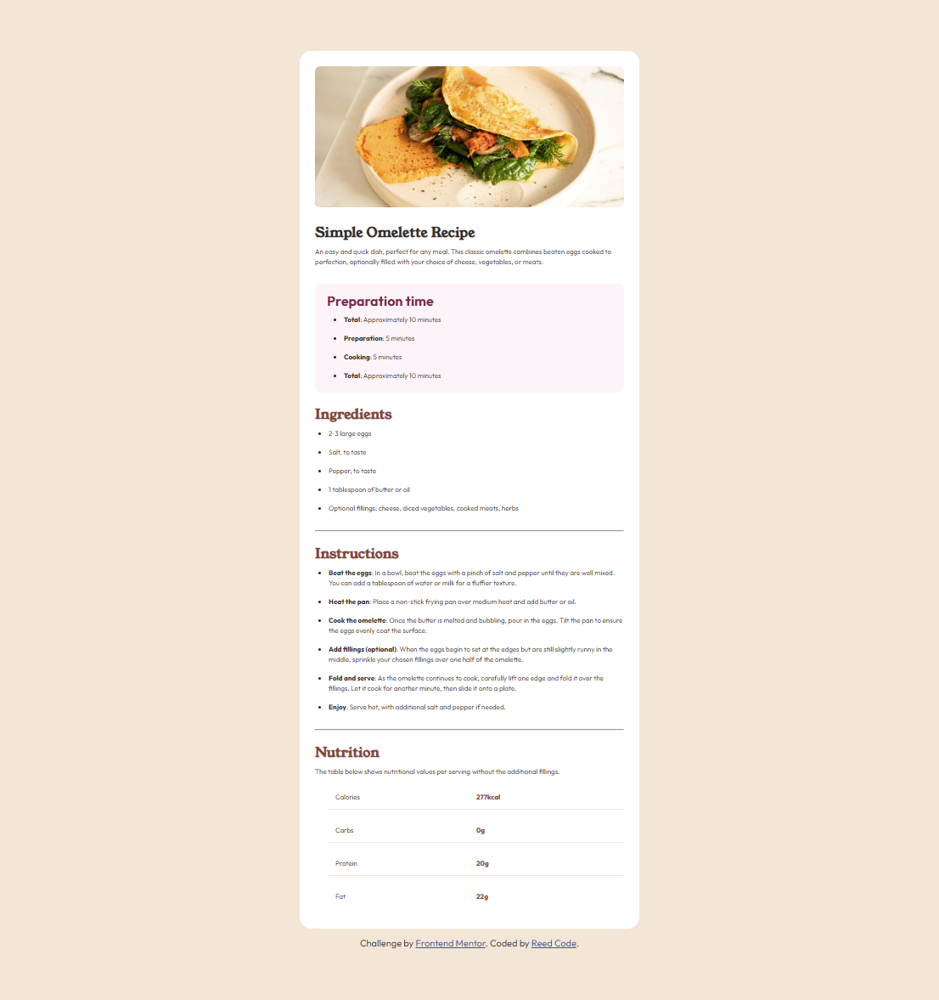

# Frontend Mentor - Recipe page solution

This is a solution to the [Recipe page challenge on Frontend Mentor](https://www.frontendmentor.io/challenges/recipe-page-KiTsR8QQKm). Frontend Mentor challenges help you improve your coding skills by building realistic projects.

## Table of contents

- [Screenshot](#screenshots)
- [Links](#links)
- [My process](#my-process)
  - [Built with](#built-with)
  - [What I learned](#what-i-learned)
- [Author](#author)

### Screenshot

### Links

- Solution URL: [Add solution URL here](https://github.com/hsfarid/Recipe-page)
- Live Site URL: [Add live site URL here](https://hsfarid.github.io/Recipe-page/)

## My process

- I first sketched the entire work on a paper
- Then I wrote the html elements
- and finally styled the page using css

### Built with

- Semantic HTML5 markup
- CSS custom properties
- Flexbox
- CSS Grid
- CSS variables

### What I learned

- I learned how to use CSS variables
- I learned how to use and style the horizontal rule element
- I also hone my flex box and grid skills

## Author

- Frontend Mentor - [@hsfarid](https://www.frontendmentor.io/profile/yourusername)
- Twitter - [@reed_code](https://www.twitter.com/reed_code)
